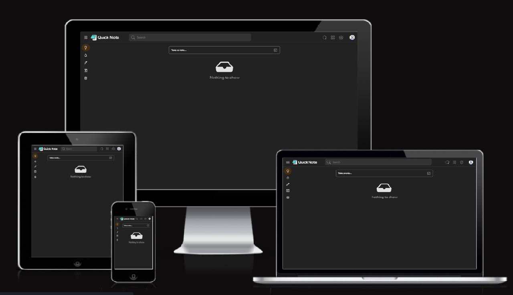

# Quick Note

*A Mern WebApp With the functionality like Google Login ,Note Sharing by email,Note Reminder, Feedback & More*

<p align=center>

</p>

## *Start Guide*

1. Make new directory & clone the Repo

```
$git clone https://github.com/atulchourasiya/QuickNote.git .
```
2. Delete pre-existing build in root directory
```
Press the delete 
```
###  *Server Setup*

3. Run command in root directory
```
$npm install
```

4. Create .env in root directory
```
MONGO=YOUR_MONGO_STRING
```
```
CLIENT=YOUR_GOOGLE_CLIENT
```
```
CLIENT_SECRET=YOUR_GOOGLE_CLIENT_SECRET
```
```
CLIENT_URL=http://localhost:5000
```
```
CALLBACK_URL=http://localhost:5000/auth/google/callback
```
```
JWT_SECRET=YOUR_JWT_SECRET
```
```
SECRET=ANY_SECRET_STRING
```

###  *Client Setup*

5. Change directory to client
```
$ cd .\Client
```

6. Run command in client directory
```
$npm install
```

7. Create .env in client directory
```
REACT_APP_SERVICE_ID=YOUR_EMAIL.JS_SERVICE_ID
```
```
REACT_APP_TEMPLETE_ID=YOUR_EMAIL.JS_TEMPLETE_ID
```
```
REACT_APP_PUBLIC_KEY=YOUR_EMAIL.JS_PUBLIC_KEY
```
```
REACT_APP_API_HOST=http://localhost:5000
```
8. Run command in client directory
```
$ npm run build
```
9. Move build in root
```
CTRL+C CTRL+V
```
###  *Ready to launch*
10. Change directory to root
```
$cd..
```
11. Run command in root directory
```
$npm start
``` 
## Features

- Google login
- Note sharing by email
- Note reminder
- Light/dark mode toggle
- Feedback
- Fullscreen mode
- Add note
- Archieve note
- Custom lables
- Pin note
- Clone note
- Create checklist 
- Schedule delete note

## Live
[Quick Note](https://quicknote.onrender.com)

## Badges

[](https://choosealicense.com/licenses/mit/)


## Authors

- [@atulchourasiya](https://www.github.com/atulchourasiya)


